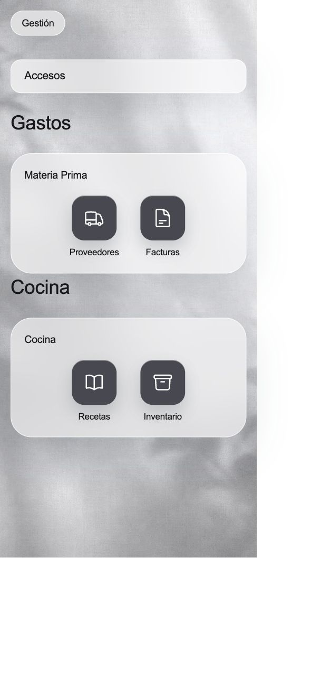
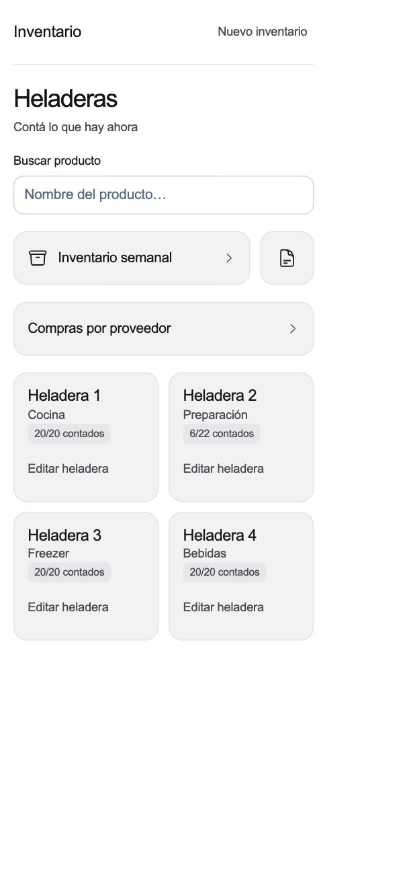
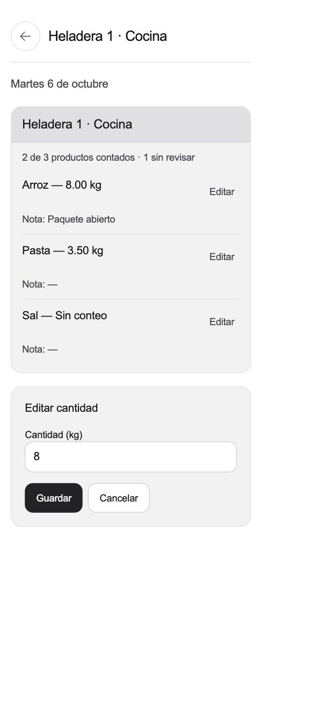
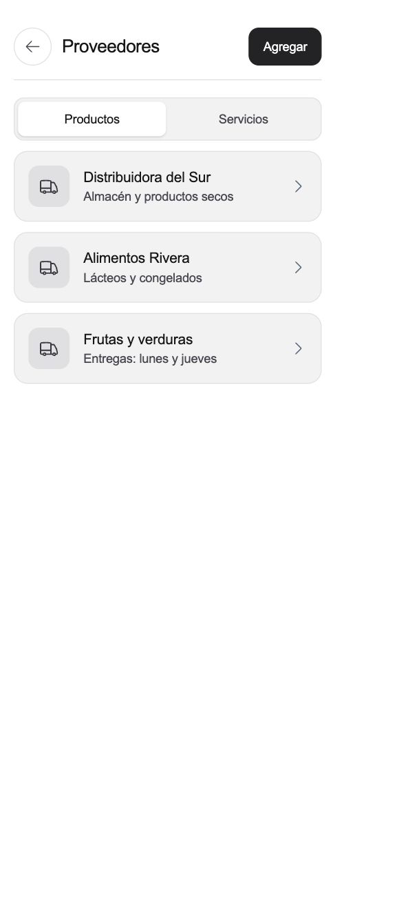
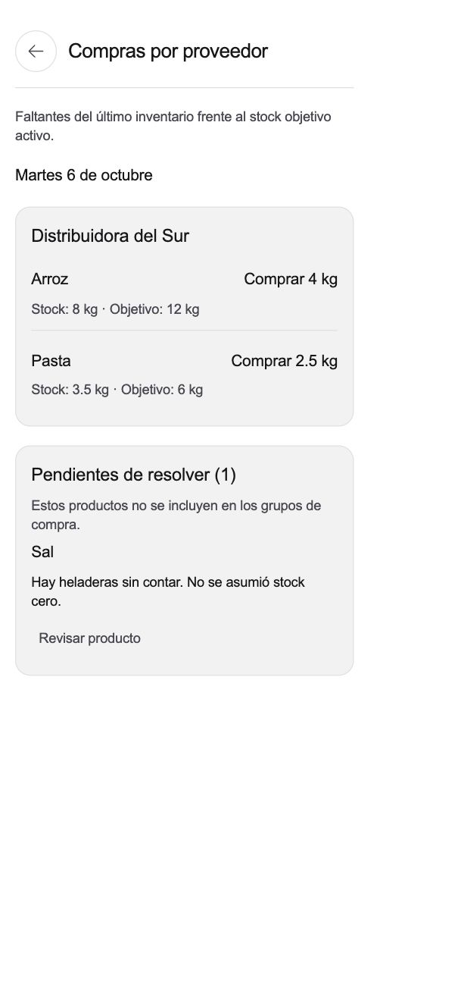

# Clear mobile design

The launcher at `/` keeps its wallpaper, glass groups, and neutral app icons.
Every work screen uses a white background and solid, light-gray card surfaces. This includes
inventory, history, target stock, purchases, suppliers, invoices, employees,
recipes, menu, access management, and the dashboard.

## Visual rules

- White canvas; neutral text and dividers; charcoal primary actions. Status colors keep
  their meaning and have readable contrast on white.
- Solid cards with fine borders. Blur and translucent panels are scoped to
  `.home-screen`; modal backdrops only dim the page.
- Geist variable typography with tighter heading tracking, balanced titles, and
  tabular stock numbers; consistent page widths, spacing, controls, and focus.
- The inventory overview omits the top status card, uses “Inventario semanal”
  for weekly navigation, and shows compact count labels on each fridge. Empty
  comments are hidden; opening a fridge edit form expands its tile to full width.
- Inputs use 16px text; shared buttons and icon controls have 44px touch targets.
  Browser zoom is enabled, and reduced-motion preferences are respected.
- Fridge groups use neutral gray headers and cards instead of colored accents.
- The dashboard has a light palette and larger rows; its detail panes take the
  full phone width while retaining a split view on larger screens.
- No stock, targets, purchasing, authorization, or database rules change.

The semantic styles live in `src/app/globals.css` and the shared UI components.
Work screens use `app-*` surfaces. Legacy global color/blur overrides were removed;
new pages should use the same solid surfaces rather than reintroducing glass.

## Presentation previews

These screenshots use synthetic data, the compiled application stylesheet, and
shared UI components. They demonstrate the design; they are not screenshots of
signed-in production records or proof of every end-to-end workflow.

### Home: retained glass

### Inventory: white work screens

### Counting and forms

### Suppliers

### Purchases

## Verification

The existing 140 tests, lint, type checking, and production build pass. Visual
previews were inspected at phone widths; DOM checks at 320px and 390px confirmed
no horizontal overflow on the sampled screens, with a 768px inventory check as
well. Computed styles confirmed a white work-screen background, 16px input text,
no blurred work panels, and `blur(28px)` on home glass. Both prefixed and standard
backdrop-filter declarations survive CSS compilation.
